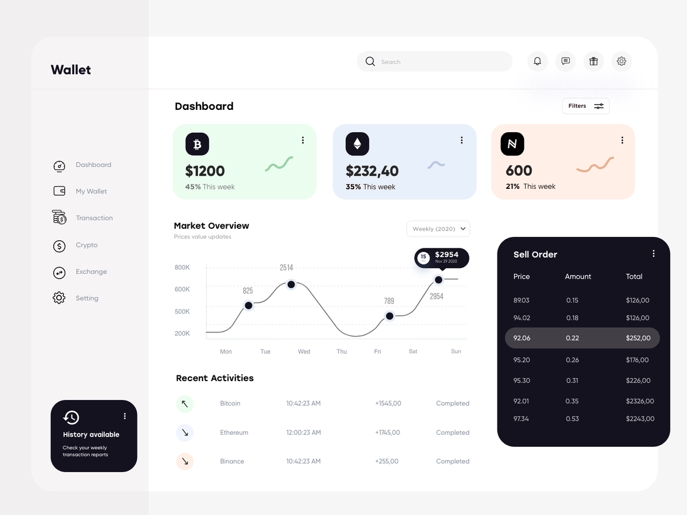

  

 

<h1 align="center">Dashboard</h1>

Build a Finance dashboard using React and Reducer

<h1 align="center">
  
</h1>

## Summary

  - [Begin](#Begin)
  - [Requirement](#Requirement)
  - [Installation](#Installation)
  - [Test](#Test)
  - [Deploy](#Deploy)
  - [Author](#Author)
  - [UI Based](#UI-Based)
  - [Useful technologies](#Useful-technologies)

## Begin

Follow the instructions below to run the app.

## Requirements

What do  you need to run.

* **[Node v>=13.8.0](https://nodejs.org/en/)** - Install Node JS in your machine.

### Installation

- Install all the dependencies.

Execute

    npm install

Or

    yarn install

- Start the project.
 
    npm start

Or

    yarn start

## Test

Executes the test

    npm run test

## Deploy

 - Netlify
## Author

  - **Mário Batalha** 

## Technologies
  - JS
  - HTML5 & CSS3
  - React
  - Material Ui
  - Material UI- Icons
  - Reducer
  - React Router
